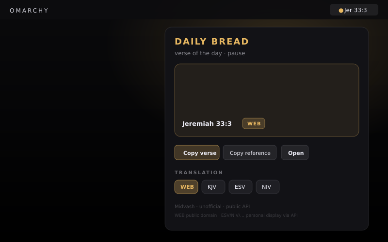

# Scriptural



Give us this day the Bible verse. Unofficial.

Daily Bible scripture for Omarchy — bar **lingers** on today’s short reference
(`Jer 33:3`), panel shows the verse. Named for the familiar prayer line.
Powered by the **Midvash** public VOTD API. No API keys. No publisher chrome.

**ID:** `kenhara.scriptural`  
**Author:** Harris Kenny  
**License:** MIT  
**Version:** 0.1.18

### 0.1.18
- Bound HTTP, stdout, and cache reads (marketplace #2219).
- Make Bible / scripture wording obvious in panel, footer, manifest, tooltip, and README.

### 0.1.17
- Marketplace preview.png is the live Omarchy smoke screenshot.

### 0.1.16
- Marketplace category Widgets (was Info); drop leftover Pause from pitch; README version catch-up (0.1.15 footer/subheader already shipped).

### 0.1.15
- Quiet job-line subheader + unofficial footer.

### 0.1.14
- Tintable FA book bar chip (glyph + short ref); glyph'd Copy / Copy ref / Open; drop "pause" from subheader.

### 0.1.13
- KeyboardPanel + PanelKeyCatcher shell (Compliantish/Rocketlauncher) so nested bar-widget panels open on Quattro VPS; BarWidget toggle warns if panelLoader.item is null.

### 0.1.12
- F1: replace Style.font.title/subtitle with Style.font.body (oracle rocketlauncher tokens only) so panels load on VPS/smoke Omarchy.

### 0.1.11
- Remove Panel `import "."` (was shadowing qs.Ui Panel under Loader → dead bar clicks); sibling types via qmldir/module context like Rocketlauncher.

### 0.1.10
- python3 -B + PYTHONDONTWRITEBYTECODE on votd Process; onLoadFailed no longer re-enters refresh loops (single guarded bootstrap); panel load error console.warn + truncated tooltip.

### 0.1.9
- Panel `import "."` so Loader resolves sibling types; best-effort panel load error in tooltip.

### 0.1.6
- Renamed plugin id `harris.scriptural` → `kenhara.scriptural` (install path `~/.config/omarchy/plugins/kenhara.scriptural`). Display name unchanged.

### 0.1.5
- Audit fixes: honest discoverability (`Info` category); cache mkdir + persist
  logging; chip version write-back; all seven versions on chips; English API
  errors; shortReference abbrevs; chip highlight follows displayed verse.

### 0.1.3
- Discoverability: category **Widgets**; expanded `keywords` + restored `barWidget.aliases` for search docs; honest note.

### 0.1.2
- Pre-ship checklist: `Text.PlainText` on API verse/ref, https-only Open,
  UA from `manifest.json`, drop dead summon/`aliases`, pluginDir decode,
  witty pitch + bar linger of short ref, Controls L/M honesty, version sync.

### 0.1.1
- Pre-audit harden from sibling audits (Rocketlauncher / Compliantish /
  Enricherino / Encyclopedic): named `Style.font.*` tokens, clipboardText +
  honest copy toasts, FileView cache (no mkdir race), dead `dataChanged`
  removed, hover on actions, UTC VOTD day, `cached` honesty, popout-switch,
  UA `Scriptural/0.1.1`, README hero preview, LICENSE/docs scrub.

### 0.1.0
- MVP — bar short ref (`Jer 33:3`) or `● Bread`, panel verse + chips,
  `scripts/votd.py` → Midvash public VOTD, Copy verse / Copy reference / Open,
  daily disk cache, middle-click refresh, schema `version` + reserved `language`.

## Repository

**GitHub:** https://github.com/kenhara/omarchy-scriptural  
Local folder: **`omarchy-scriptural`**.

## Unofficial disclaimer

**Scriptural is unofficial.** It is **not** affiliated with, endorsed by, or
sponsored by Midvash, any Bible publisher, or any related entity. “Scriptural”
is a familiar prayer / scripture phrase. This plugin is a thin personal
client that calls a **public read** HTTP verse-of-the-day API.

Copyrighted translations (ESV, NIV, NKJV, NLT, MSG, …) are requested only for
**personal display** via Midvash’s public API. Default is **WEB** (World
English Bible), which Midvash documents as public domain / CC0. Do not
redistribute copyrighted translation text beyond what the API and publishers
allow. Attribution for the translation in use belongs to its copyright holder;
this plugin only surfaces Midvash’s `version` field and a quiet footer.

## Discoverability

Marketplace filing draft: category **Widgets** ·
tags `bar, quickshell` (suggest missing tag: `bible`).

Top-level `keywords` and `barWidget.aliases` in `manifest.json` are for
**marketplace filing drafts and human search docs** (Bible, VOTD, KJV, NIV,
ESV, Midvash, devotion, etc.). The Omarchy **bar-widget loader ignores them**
when resolving bar widgets — they do not make the widget appear in bar search.
Display name stays **Scriptural** (prayer allusion; no publisher as title).

## Install

### From GitHub

```sh
omarchy plugin add https://github.com/kenhara/omarchy-scriptural.git --enable
omarchy bar move kenhara.scriptural --section right
```

### Local copy (this tree)

The **git repo root is the plugin** (`manifest.json` at root). On an Omarchy
machine:

```sh
mkdir -p ~/.config/omarchy/plugins
cp -a . ~/.config/omarchy/plugins/kenhara.scriptural

omarchy plugin validate ~/.config/omarchy/plugins/kenhara.scriptural
omarchy-shell shell rescanPlugins

omarchy bar move kenhara.scriptural --section right
```

Hot reload applies on save under `~/.config/omarchy/plugins/`.

### Symlink (dev)

```sh
mkdir -p ~/.config/omarchy/plugins
ln -sfn /path/to/omarchy-scriptural ~/.config/omarchy/plugins/kenhara.scriptural
omarchy-shell shell rescanPlugins
```

## Configure

Open **widget settings** for Scriptural (optional):

| Schema key | Label | Default |
|------------|-------|---------|
| `version` | Bible version (`web` `kjv` `esv` `niv` `nkjv` `nlt` `msg`) | `web` |

Language is fixed to `en` in code / `defaults` (no schema knob until multi-lang
is real). No API keys. Public read only. Panel chips cover **all seven** schema
versions; chip choice mirrors into settings when the host allows write-back.

CLI smoke:

```sh
python3 scripts/votd.py --version web --language en
python3 scripts/votd.py --dry-run --version web
python3 scripts/votd.py --list-versions --language en
```

## Usage

1. **Left-click** bar (book glyph + `Jer 33:3`, or glyph alone) → panel.
2. Read today’s verse, reference, and version chip.
3. **Copy verse** / **Copy reference** / **Open** (Midvash URL).
4. Tap a translation chip (WEB · KJV · ESV · NIV · NKJV · NLT · MSG) to switch.
5. **Middle-click** bar forces a network refresh (cache bypass).

Offline: last successful verse for that **UTC date + version** stays on screen
with a **cached** chip — never presented as a fresh network fetch.

### Controls

| Input | Action |
|-------|--------|
| Left-click bar | Toggle panel |
| Middle-click bar | Force refresh VOTD |
| Right-click bar | None (host default) |
| Copy verse | Clipboard: `"text" — Reference (VER)` |
| Copy reference | Clipboard: reference only |
| Open | Midvash verse URL (`https:` only) |
| Translation chips | Switch version + refetch / cache |

## Remove

```sh
omarchy plugin remove kenhara.scriptural
```

Optional cache cleanup:

```sh
rm -rf ~/.cache/scriptural
```

## Network & deps

- VOTD: `GET https://api.midvash.com/v1/votd?language=en&version=web`
- Versions list: `GET https://api.midvash.com/v1/versions?language=en`
- Verse pages: `https://midvash.com/en/{version}/{book}/{chapter}/{verse}`
- **Deps:** Python 3 stdlib only (`urllib`). Optional clipboard helpers:
  `wl-copy` / `xclip` / `xsel` (shell fallback when Quickshell clipboard
  unavailable). Optional `xdg-open` for Open.

Outbound HTTPS on bootstrap (if cache miss), version change, or middle-click
refresh. No auth. No signup.

User-Agent: `Scriptural/<manifest version> (Omarchy unofficial; kenhara.scriptural)`
(version read from `manifest.json`).

**Timezone:** the VOTD “day” key is **UTC** (same verse worldwide for a given
UTC calendar date). Cache file: `~/.cache/scriptural/votd.json` keyed by
**UTC date + version**.

English version slugs known live (2026-08-23): `web`, `kjv`, `esv`, `niv`,
`nkjv`, `nlt`, `msg`, `asv`, `ylt`, `dra`, `bbe`, `geneva1599` (schema + chips
expose the common seven).

**Attribution:** Midvash public API. Default WEB is public domain / CC0.
Other translations remain under their publishers’ copyrights — personal
display only via the API.

## Scripts

`scripts/votd.py` — urllib only, no extra deps.

```sh
python3 scripts/votd.py --help
python3 scripts/votd.py --version web --language en
# stdout JSON: {ok, reference, text, version, url, date, error}
```

`--dry-run` and network errors emit structured error JSON (non-zero exit).
User-facing `error` is English; optional `error_detail` may carry the raw API
string.

## Layout

```
manifest.json          # kenhara.scriptural @ 0.1.5
BarWidget.qml          # bar entry + Loader → Panel; middle-click refresh
Panel.qml              # verse + chips + actions (Flickable)
ScripturalStore.qml    # cache, Process → votd.py
qmldir
scripts/votd.py
docs/preview/index.html
preview.svg
preview.png
DESIGN.md
PRE-AUDIT.md
PRE-SHIP.md
AUDIT.md
AUDIT-NOTES.md
REPO.md
LICENSE                # MIT
README.md
```

## Security baseline

- **No API keys.** Public read VOTD only.
- Cache stores the last successful verse for date+version — no credentials.
- Outbound HTTPS on cache miss, version change, or explicit middle-click
  refresh. No paid calls.
- MIT at repo root. Unofficial — not affiliated with Midvash or Bible
  publishers. Scriptural is scripture, not a publisher product.

## Preview

Open `docs/preview/index.html` in a browser for a filled HTML mock (v0.1.5)
with today’s sample (Jeremiah 33:3 WEB). Marketplace card: `preview.png`
(also embedded above).

## License

MIT — see [LICENSE](LICENSE).

Scripture text in previews and live responses is supplied by Midvash; WEB is
public domain. Other translations remain under their publishers’ copyrights.
